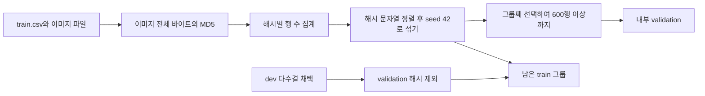

# 02. 데이터, 다수결, 이미지 그룹 분할

## 코드가 실제로 읽는 스키마

| 파일 | 사용하는 열 | 역할 |
|---|---|---|
| `train.csv` | `id`, `path`, `question`, `a`, `b`, `c`, `d`, `answer` | 정답을 가진 학습·내부 validation 원천 |
| `test.csv` | `id`, `path`, `question`, `a`, `b`, `c`, `d` | 제출 대상, 정답을 읽지 않음 |
| `dev.csv` | 위 입력 열과 `answer`로 시작하는 복수 라벨 열 | 조건을 만족하는 다수결 라벨을 추가 학습에 사용 |
| `sample_submission.csv` | 첫째 열을 ID, 둘째 열을 답 열로 사용 | 제출 행 순서·열 이름 기준 |

`train.answer`는 문자열을 정리한 뒤 `a/b/c/d`를 `0/1/2/3`으로 바꾸고 다른 값이 없는지 검사합니다. `write_sub`는 test ID로 예측을 매핑하고 sample submission 순서를 유지합니다. 실제 CSV가 제공되지 않았으므로 추가 열, 결측 분포, 총 이미지 수, 라이선스는 확인 필요입니다.

근거: `vqa_solution_code_only.ipynb` 셀 5, `vqa_097140_documented.ipynb` 셀 6. 노트북 셀 번호는 전체 셀을 1부터 셉니다.

## 공개 dev와 내부 validation은 다르다

`dev.csv`는 코드가 학습에 추가하는 데이터입니다. `va_df`는 `train.csv`에서 별도로 떼는 내부 검증셋입니다. 파일 이름에 dev가 들어간다는 이유만으로 최종 평가용 데이터라고 해석하면 안 됩니다. 코드의 `USE_DEV=True`는 공개 dev의 다수결 라벨을 학습에 사용하겠다는 설정입니다. 대회 규정상 사용 허용 범위는 제공된 자료만으로 독립 확인하지 못했습니다.

다수결 함수는 `answer` 자체를 제외하고 열 이름이 `answer`로 시작하는 모든 열을 수집합니다. 문서는 `answer1~5`를 설명하지만 구현은 열 수를 5로 고정하지 않습니다. `a/b/c/d`가 아닌 값은 투표에서 제외하고 다음 조건을 적용합니다.

1. 유효 투표가 3개 이상이어야 합니다(`DEV_MIN_VOTES=3`).
2. 최다 득표 수 / 유효 투표 수가 0.5 이상이어야 합니다(`DEV_MIN_AGREE=0.5`).
3. 1위와 2위 득표 차이가 1 이상이어야 합니다(`DEV_MIN_MARGIN=1`). 따라서 2:2 동률은 탈락합니다.

채택한 행에도 이미지 MD5를 계산하고 내부 validation 이미지 그룹과 겹치는 행을 제외합니다. 다수결로 합의가 강한 표본을 고를 수 있지만 다수가 함께 틀리는 라벨이나 선택 편향을 없애지는 못합니다.

근거: 코드 전용 셀 4·5의 `resolve_votes`, 설명 셀 5·6; 최종 발표 슬라이드 5.

## MD5 그룹 분할의 실제 절차

한 사진에 여러 질문이 달릴 수 있으므로 행 단위 무작위 분할은 같은 이미지가 양쪽에 나타나게 할 수 있습니다. 구현은 경로나 ID가 아니라 **이미지 파일 바이트**의 MD5를 그룹 키로 사용합니다. 그룹 목록을 먼저 정렬하고 `np.random.RandomState(SPLIT_SEED)`로 섞습니다. 그룹을 통째로 선택해 목표 행 수 이상이 되면 멈추므로 validation 크기는 그룹 경계에 따라 600을 넘을 수 있습니다.

기존 `val_y.npy`가 있으면 정답 배열이 일치하는지 검사합니다. 다만 정답 배열만 같다고 ID·행 순서까지 같다는 보장은 부족합니다. 확실한 재현을 위해서는 데이터 원본, 이미지 해시와 행 ID도 함께 관리해야 합니다. 이는 이번 코드에 추가한 기능이 아니라 향후 개선 제안입니다.

근거: 코드 전용 셀 5의 `file_md5`, `groups`, `val_g`, `old_y`.

## 무엇을 막고 무엇을 못 막는가

바이트가 같은 파일의 교차 유입을 줄이는 장점이 있습니다. 하지만 같은 사진을 다시 JPEG로 저장하거나 크롭·리사이즈하면 해시가 달라집니다. 같은 장소의 다른 촬영, 유사한 질문 템플릿, 거의 같은 보기까지 탐지하는 방식은 아닙니다. MD5는 여기서 그룹 식별용이며 보안 무결성 검증용으로 사용하는 것은 아닙니다.

추가 검토로 지각 해시·이미지 임베딩 유사도와 질문 템플릿 그룹을 사용할 수 있습니다. 이는 수행 사실이 아닙니다. 검증과 학습의 독립성은 어떤 정보가 반복되는지를 기준으로 점검해야 합니다.

## 데이터 수량의 근거와 한계

초기 발표 슬라이드 5는 학습 6,114행에 dev 2,097행을 더해 8,211행이라고 기록합니다. 설명 노트북 셀 2도 dev 2,097행을 설명하고 최종 발표 슬라이드 5가 이를 반복합니다. 실제 출력이 없으므로 이 숫자는 **자료상 수량**이며 현재 실행으로 재계산하지 않았습니다.

설명 노트북 셀 14는 test 6,714행, 초기 발표 슬라이드 2는 처리 6,738문항, 최종 발표 슬라이드 5는 Public 3,357행을 기록합니다. test 전체와 Public 부분집합은 다를 수 있지만 6,738과 6,714의 차이는 원본 CSV·실행 로그 없이 해결되지 않습니다. 숫자를 임의로 통일하지 않습니다. train 전체 행 수와 사진 수 역시 위 숫자들로 역산하지 않습니다.
